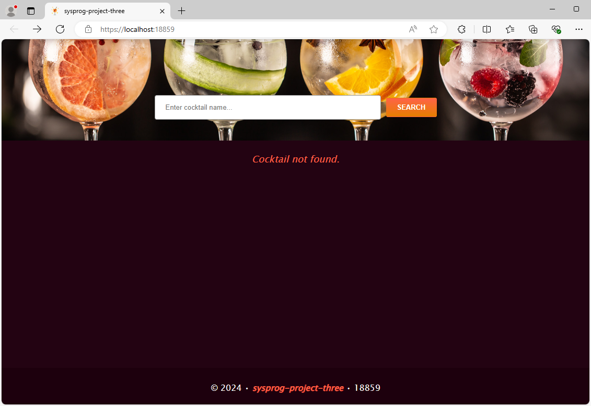
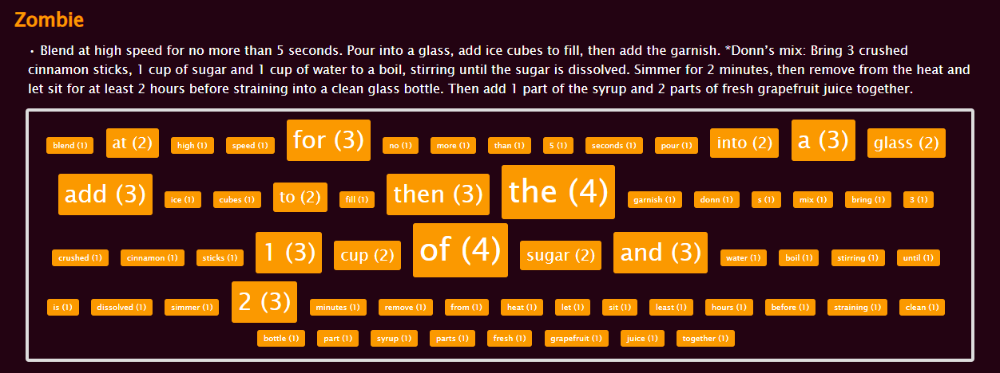

# About the Project

I was tasked with using TheCocktailDB API to fetch cocktail preparation instructions based on the cocktail name and display them with a `WORD CLOUD`. The primary focus was on using the `Reactive Extensions for .NET (Rx)` to implement reactive programming paradigms. Though Rx is single-threaded by default, this implementation includes multithreading and `schedulers` to enhance performance and responsiveness.

 

Example:

- The application fetches preparation instructions for all cocktails that contain the entered word(s) from TheCocktailDB API and display them in the following format, along with a `WORD CLOUD` showing the frequency of words in the instructions:

